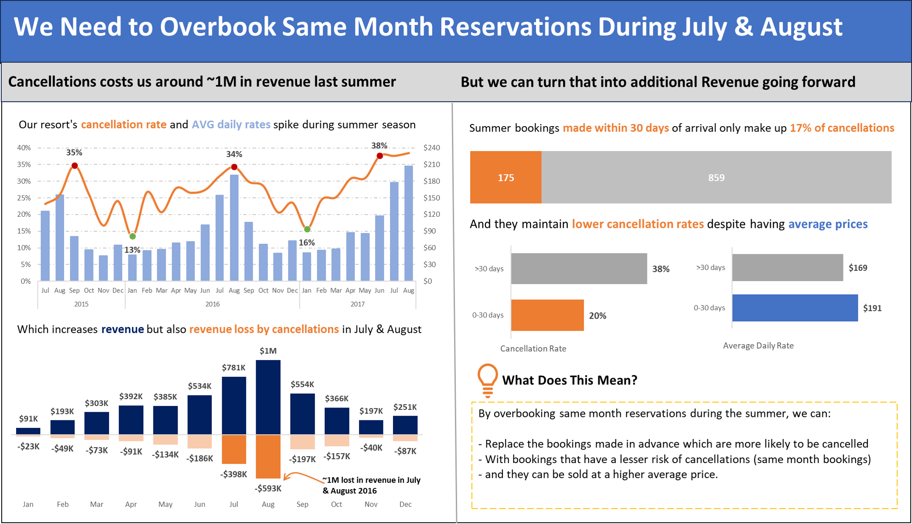

# 🏨 Maven Hotel Group – Booking Analysis Dashboard

## Project Overview

This project was completed as part of a data visualization challenge for **Maven Hotel Group (MHG)**, a Portuguese hotel chain operating resorts in **Lisbon** and **Algarve**. The goal was to transform raw booking data from pivot tables into a clear, insight-driven dashboard for the leadership team.

---

## 📊 Dashboard Preview



---

## 🚩 Problem Statement

A business analyst identified that **cancellations cost the resort approximately ~$1 million in revenue** during the summer of 2016. The challenge was to visualize the data clearly and propose an actionable recommendation to recover and grow that revenue going forward.

---

## 💡 Key Insights

- **Cancellation rates spike in summer** — peaking at **35–38%** in July and August each year
- **Revenue loss was highest in July & August 2016** — totalling **$593K and $398K** respectively
- Bookings made **within 30 days of arrival** account for only **17% of total cancellations**
- Same-month bookings (0–30 days) have a much lower cancellation rate: **20% vs 38%** for advance bookings
- Despite lower risk, same-month bookings command a **higher average daily rate: $191 vs $169**

---

## ✅ Recommendation

> **Overbook same-month reservations during July & August**

By replacing high-risk advance bookings with lower-risk same-month bookings, MHG can:
- Reduce revenue lost to cancellations
- Capture bookings at a higher average nightly rate
- Turn a $1M loss into an additional revenue opportunity

---

## 🛠️ Tools Used

- **Microsoft Excel** — Pivot Tables, Charts, Dashboard Design
- Data cleaning and aggregation via Excel formulas

---

## 📁 File Structure

```
maven-hotel-group-dashboard/
│
├── MHG_Booking_Data.xlsx       # Main Excel file with raw data, pivot tables & dashboard
├── dashboard_screenshot.png    # Final dashboard visual
├── project_brief.png           # Original project brief
└── README.md                   # Project documentation (this file)
```

---

## 📌 Skills Demonstrated

- Data storytelling and visualization
- Dashboard layout and design principles
- Consistent and deliberate use of color to highlight key insights
- Translating business data into actionable recommendations

---

## 👤 Author

**Bushra Khan**
Data Analyst | [thedataalchemist.io](https://thedataalchemist.io) • [LinkedIn](https://www.linkedin.com/in/bushra-nazeer-khan) • [GitHub](https://github.com/BushraKhan359)

*Created as part of a Maven Analytics data visualization project.*
